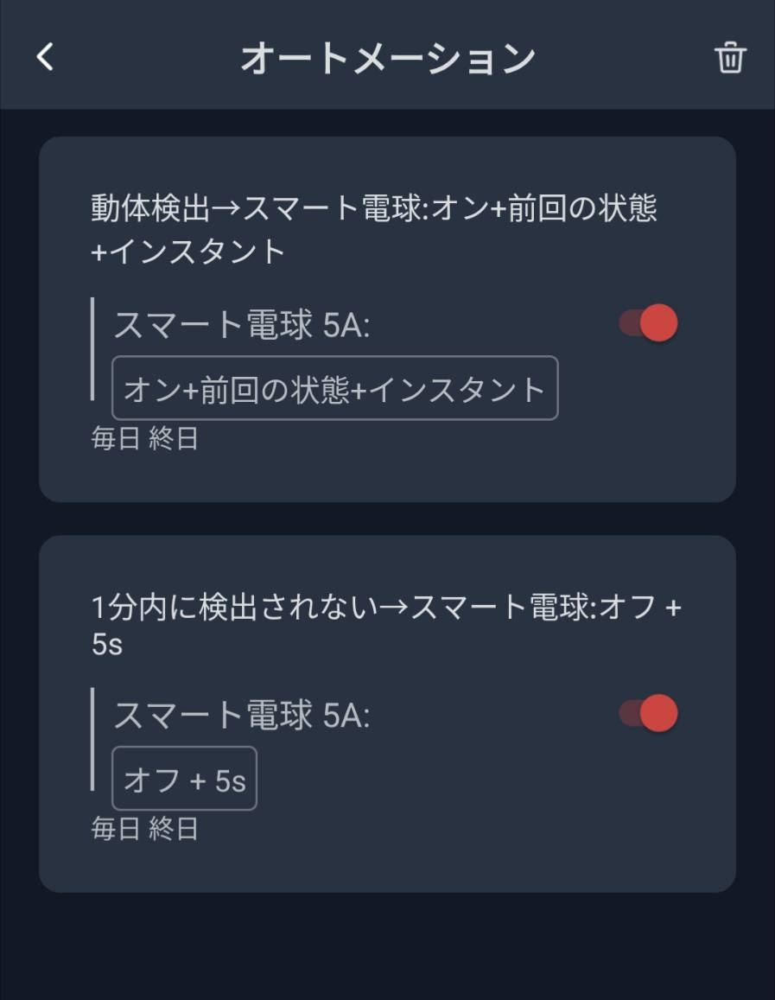

# 概要
その日の天気を照明の色で教えてくれる便利なライトで、照明にはIoT家電で有名なSwitchBotのスマート電球を使っています。
玄関や廊下にライトを設置して使いましょう。また、人感センサーに連動して照明が点灯するようにしているので、人感センサーも必要です。
サーバーはGoogle Cloud Platform (GCP)上で動作します。

# 目次
- 下準備
    - SwitchBot スマート電球の準備
    - SwitchBot 人感センサの準備
- 構築
    - SwitchBotアプリの設定
    - ソースコードの準備
    - ローカルでデバッグ
    - Google Cloud Platform上にサーバーを構築

# 下準備
物品購入

## SwitchBot スマート電球の準備
SwitchBot スマート電球 E26というものを買います。E26は電球の口金径を示していますが、一般的な家庭の電球であれはほぼ確実にE26なのでこれでいいです。というかE26以外のスマート電球は売ってないです(2024年5月)。

## SwitchBot 人感センサの準備
SwitchBot 人感センサーという赤外線センサーを買います。これで人体の動きを感知します。スマート電球との連動性を高めるため、できるだけ電球の近辺で感知するようにした方がいいです。

# 構築
処理の流れとしては以下のようになっています。
1. 人感センサーが人の動きを感知
2. スイッチボットのオートメーション機能でスマート電球をON
3. 電球が点灯するという状態変化によってWebhookがGCPに立てたサーバーに送られる
4. サーバー側で天気予報を取得し、雨だったらスマート電球をブルー、晴れだったらスマート電球をオレンジにする命令を送る
5. オートメーションの機能でスマート電球を消灯。

## SwitchBotアプリの設定
1. まず、人感センサとスマート電球をアプリに追加します。
2. 次に、人感センサ -> オートメーション と進み、以下のように設定します。動体検出したらライトをすぐに点灯するという設定が上の設定で、1分間検出されなかったら電球を切るのが下の設定です。



3. この時点で、人感センサーの前で動いたら電球が付くようにはなっているはずです。これだけだと天気によって色は変わらないので、ここからサーバー側の構築をしていきます。

## ソースコードの準備
1. アプリを編集したいディレクトリでgit cloneを実行します。
```
git clone <このディレクトリのgit URL>
```
2. `.sample.env`ファイルの名前を`.env`に変更し、環境変数を書き換えます。
```
TOKEN=<YOUR TOKEN>
SECRET=<YOUR SECRET>
DEVICE_ID=<DEVICE ID OF COLOR BULB>
URL=<URL TO GOOGLE CLOUD PLATFORM>
```
3. TOKENとSECRETはSwitchBotアプリから取得します。URLはWebhookが送られるURLですが、後ほどGCPをデプロイする部分で取得します。DEVICE_IDはスマート電球のIDです。以下のコードを走らせて取得しましょう。`get_devicelist.js`のPathは実行する階層に合わせてください。`package.json`がある階層がおすすめです。
```
node src/get_devicelist.js
```
4. `src/server.js`中の気象庁APIに繋がるURLを自分の地域向けに変更してください。"https://www.jma.go.jp/bosai/forecast/data/forecast/270000.json"は大阪の天気予報です。東京の場合は`270000`の部分を`130000`に変更すればOKです。
5. こちらでソースコードの準備は完了です。次はローカルでデバッグする手順です。

## ローカルでデバッグ
1. package.jsonに記載されたモジュールをインストールする。
```
yarn
```
2. server.jsの内容を実行する。
```
yarn start
```
3. ngrokでURLを作って、localhostのport 8080に繋がるようにする。
```
yarn ngrok
```
4. この時表示されるURLを`.env`の`URL=`の部分に書き込み、SwitchbotがURLを送る先を変更します。httpsではなく、httpの方を使うことに注意してください。SwitchBot APIは受信側がhttpsだと動作しないという不親切設計です。一度webhookを送るURLを設定した後、変更したいときは`yarn update_webhook`としましょう。
```
node src/set_webhook.js
```
5. ここで人感センサーの前で動くと、天気によって照明の色が3秒くらい変わって元に戻るはずです。照明の色が変わる時間は環境によって多少変化してしまいます。
6. 次はサーバーの構築とデプロイです。

## Google Cloud Platform上にサーバーを構築
1. [Google Cloud Platformでプロジェクトを作成し、Google Cloud CLIをインストール](https://cloud.google.com/appengine/docs/standard/nodejs/building-app/creating-project?hl=ja)してください。
2. cloneしたディレクトリに入ります。app.yamlと同じ階層に入ってください。
3. 以下のコマンドを実行すると、Google Cloudにサービスがデプロイされます。デプロイ先プロジェクトの指定は`package.json`に書いてあるので、適宜名前を変更してください。何も変更しないと`switchbot-controller`という名前になります。
```
yarn deploy
```
4. `Deployed service [default] to [https://hogehoge.appspot.com]`というメッセージが出ているので、このURLをコピーし、URLを`.env`の`URL=`の部分に書き込み、Webhookが送られるURLをGCPのものに変更します。
```
yarn update_webhook
```
5. 以上でデプロイ完了です。スマート電球が切れている状態から人感センサーの前を通ると電球が点き、色が変わるはずです。(SwitchBot APIの不具合で何回か通過しないと変わらないことがあります。)